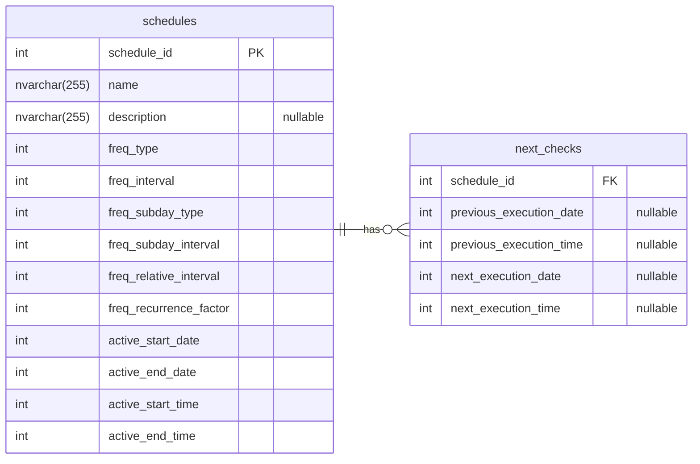
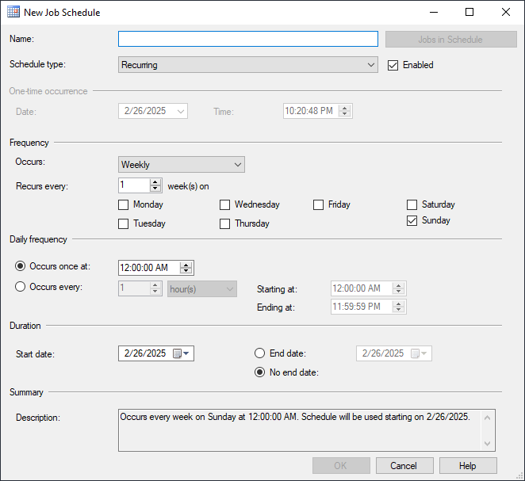

# SQL Server Scheduling Engine

A comprehensive set of stored procedures for Microsoft SQL Server that provide robust scheduling functionality for your applications. This solution is 100% compatible with SQL Server Agent Scheduling and enables developers to calculate and retrieve the next execution times of scheduled events.

## Problem Statement

Microsoft SQL Server provides powerful scheduling capabilities through SQL Server Agent, but the underlying scheduling logic is not easily accessible:

- The `[sysschedules]` table is tightly integrated into the SQL Server core
- Microsoft does not publish the scheduling calculation logic
- No public API endpoints are provided to programmatically retrieve the next execution time
- The built-in description generator provides limited information when used programmatically

## Solution Overview

This project implements a complete scheduling solution through a set of stored procedures that replicate and extend SQL Server Agent's scheduling functionality:

- `[dbo].[sp_get_schedule_description]` - Generates human-readable schedule descriptions
- `[dbo].[sp_get_schedule_next_execution_date_and_time]` - Calculates the next execution time based on schedule parameters
- `[dbo].[sp_plan_next_check]` - Manages schedule execution tracking

## Database Schema

The minimum required schema for the scheduling engine consists of two tables:

- `[dbo].[schedules]` - Stores schedule definitions compatible with SQL Server Agent's `[sysschedules]` format
- `[dbo].[next_checks]` - Tracks previous and next execution times for each schedule

The complete schema creation script is available in [create_schema.sql](./create_schema.sql).


## Core Procedures

### Schedule Import Tool: `[dbo].[sp_copy_from_sysschedules]`

The most efficient way to create schedules:

1. Use SQL Server Management Studio to create a SQL Agent schedule with your desired pattern
2. Use the provided stored procedure [sp_copy_from_sysschedules](./sp_copy_from_sysschedules.sql) to import this schedule into your application's scheduling system

<picture>
  <source media="(prefers-color-scheme: dark)" srcset="./scheduling-ui-dark.png">
  <source media="(prefers-color-scheme: light)" srcset="./scheduling-ui-light.png">
  
</picture>

### Schedule Description Generator: `[dbo].[sp_get_schedule_description]`

Creates comprehensive human-readable descriptions of schedule configurations.

Example of the usage:
```SQL
DECLARE @desc VARCHAR(MAX);

EXEC [dbo].[sp_get_schedule_description] 
@freq_type = 4, 
@freq_interval = 1, 
@freq_subday_type = 8, 
@freq_subday_interval = 1, 
@freq_relative_interval = 16, 
@freq_recurrence_factor = 0, 
@active_start_date = 20241205, 
@active_end_date = 20250605, 
@active_start_time = 2457, 
@active_end_time = 3457,
@schedule_description = @desc OUTPUT;

PRINT @desc;
```

Comparison of description outputs:

- SQL Server Agent UI description:
  `Occurs every day every 1 hour(s) between 12:00:00 AM and 12:34:57 AM. Schedule will be used between 12/5/2024 and 6/5/2025.`

- SQL Server Agent's `[msdbo].[dbo].[sp_help_schedule]` output with `@include_description=1`:
  `Every day every 1 hour(s) between 0 and 3457`

- Our `[dbo].[sp_get_schedule_description]` output:
  `Occurs every day every 1 hours between 12:24:57 AM and 12:34:57 AM. Schedule is used between 2024-12-05 and 2025-06-05.`

### Next Execution Calculator: `[dbo].[sp_get_schedule_next_execution_date_and_time]`

Accurately calculates when a schedule will run based on its configuration parameters, taking into account the date and time of previous execution.

Example of the usage:
```SQL
DECLARE @next_execution_date INT, @next_execution_time INT;

EXEC [dbo].[sp_get_schedule_next_execution_date_and_time] 
@freq_type = 4, 
@freq_interval = 1, 
@freq_subday_type = 8, 
@freq_subday_interval = 1, 
@freq_relative_interval = 16, 
@freq_recurrence_factor = 0, 
@active_start_date = 20241205, 
@active_end_date = 20250605, 
@active_start_time = 2457, 
@active_end_time = 123457,
@last_execution_date = NULL,
@last_execution_time = NULL,
@next_execution_date = @next_execution_date OUTPUT,
@next_execution_time = @next_execution_time OUTPUT;

PRINT [msdb].[dbo].[agent_datetime](@next_execution_date, @next_execution_time);
```

The output when executed on April 26th, 2025 at 4:30PM would be: `Apr 27 2025 12:24AM`.

### Schedule Execution Manager: `[dbo].[sp_plan_next_check]`

Manages schedule execution tracking by creating or updating records in the `[dbo].[next_checks]` table. This procedure is designed to be called from applications, keeping the execution logic in SQL Server while providing necessary functionality to client applications.

```SQL
EXEC [dbo].[sp_plan_next_check] @schedule_id = 1;
```

## Additional Utilities

### Automatic Description Generator: `[dbo].[trigger_schedules_description_on_insert_update]`

This trigger automatically populates the `[description]` column of the `[dbo].[schedules]` table whenever a schedule is created or modified, ensuring descriptions are always up to date.

## Usage Examples

### Simple One-Time Schedule

Creating a one-time immediate execution schedule:

```sql
INSERT INTO [dbo].[schedules] (
    [name], freq_type, freq_interval, freq_subday_type,
    freq_subday_interval, freq_relative_interval, freq_recurrence_factor,
    active_start_date, active_end_date, active_start_time, active_end_time
)
VALUES ('OneTime test schedule', 1, 0, 0, 0, 0, 0, 0, 0, 0, 0);
```

Additional schedule pattern examples are available in [schedule_examples.sql](./schedule_examples.sql).

